# RAG-QA: Retrieval-Augmented Generation Question Answering

This project is a local-first RAG system for question answering over your own PDF documents. It uses a hybrid search (semantic + keyword) to provide relevant answers.

## System Architecture

The system's workflow is divided into two main stages: data indexing and query retrieval, both designed to run entirely on your local machine.

### Data Flow Diagram



### 1. Data Indexing (`rebuild_vectors.py`)

- **Document Loading**: PDFs from the `uploads/` directory are loaded using `PyMuPDF`.
- **Text Chunking**: The extracted text is split into overlapping chunks using `RecursiveCharacterTextSplitter`.
- **Embedding Generation**: `HuggingFaceEmbeddings` with the `all-MiniLM-L6-v2` model generates vector embeddings for each text chunk.
- **Vector Storage**: The embeddings and their corresponding text chunks are stored in a `FAISS` index in the `Vector_store/` directory for efficient similarity search.

### 2. Query Retrieval (`retriever.py`)

- **Keyword Extraction**: The user query is processed by a local Ollama model (`codeqwen:7b-chat-v1.5-q8_0`) to extract key terms.
- **Hybrid Search**:
  - **Lexical Search**: A keyword scan is performed across all documents to find exact matches (max 5 results).
  - **Semantic Search**: A similarity search is executed on the FAISS index to find contextually relevant chunks (max 5 results).
- **Result Consolidation**: The results from both search methods are combined, deduplicated, and presented to the user.

## Quick Start

### Prerequisites

- Python 3.8+
- [Ollama](https://ollama.ai/) installed and running.

### Setup

```bash
# Clone the repository
git clone <your-repo-url>
cd RAG-QA

# Create a virtual environment and activate it
python3 -m venv venv
source venv/bin/activate # On Windows: venv\Scripts\activate

# Install dependencies
pip install -r requirements.txt

# Pull the Ollama model for keyword extraction
ollama pull codeqwen:7b-chat-v1.5-q8_0
```

### Usage

1.  **Add Documents**: Place your PDF files into the `uploads/` directory.

2.  **Build Knowledge Base**: Run this script once to index your documents.
    ```bash
    python rebuild_vectors.py
    ```

3.  **Ask Questions**: Start the retriever to ask questions.
    ```bash
    python retriever.py
    ```
    **Example:**
    ```
    Enter your query (or 'exit' to quit): what is gst
    ```
